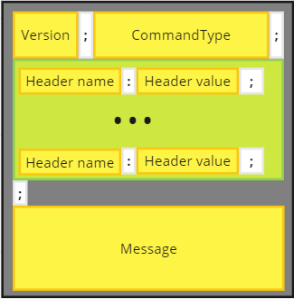
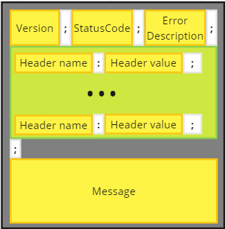

# What is RyansProtocol (Scope)

RyansProtocol is the protocol designed to communicate with RyansDB in a normalized way. The protocol itself is based on the HTTP Protocol. ([learn more](https://datatracker.ietf.org/doc/html/rfc2616))

Some questions have been raised about what the protocol should look like:

- [X] Control Version
- [ ] A charset config ?
- [ ] A Content-Encoding ? Such as accepting gzip, compress, etc.
- [ ] A Content-Type ? I don't think so (it'll always be a string)
- [ ] A custom headers communication ?

I'm still pondering these questions, but they aren't hindering me from designing the first version of the protocol.

## 1. Request

  

* **Version:** The protocol version (currently at 1.0.0).
* **CommandType:** The type of the command.
  1. RawQuery
  2. StoredProcedure
* **Headers:** Request headers where we can pass, for example, Content-Encoding.
* **Message:** The actual message, typically containing the SQL query.

## 2. Response

  

  
* **Version:** The protocol version (currently at 1.0.0).
* **StatusCode:** The status code of the response (Status codes not defined yet).
* **ErrorDescription:** The error description of the status code (when applicable).
* **Headers:** Response headers where we can pass, for example, Content-Encoding.
* **Message:** The response to the query.
